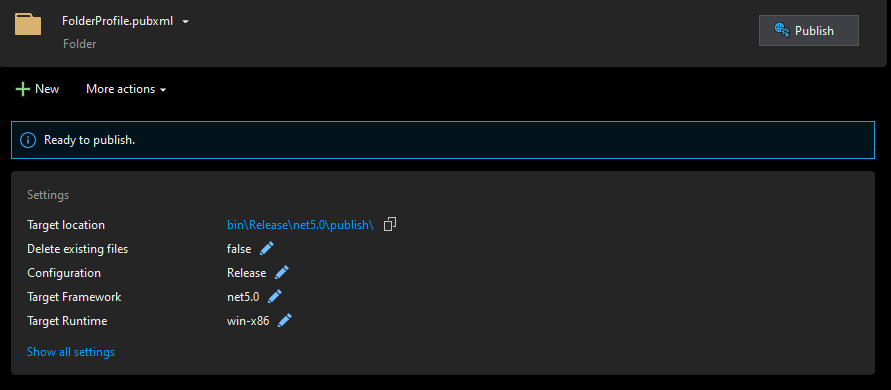

HANGFIRE
=================

# Conteúdo

1. [Introdução](#1-introdu%C3%A7%C3%A3o)

2. [Hangfire](#2-hangfire)
    1. [Instalação](#21-instala%C3%A7%C3%A3o)
    2. [Classe Abrastrata](#22-classe-abrastrata)

3. [Jobs](#3-jobs)
    1. [Instalação](#31-instala%C3%A7%C3%A3o)
	2. [Jobs Instalados](#32-jobs-instalados)
	3. [Executar Job](#33-executar-job)
	4. [Agendar Execução](#34-agendar-a-execu%C3%A7%C3%A3o)
	5. [Execução Contínua](#35-execu%C3%A7%C3%A3o-cont%C3%ADnua)
	6. [Excluir](#36-exluir)

4. [Hangfire Sercice Monitor](#4-hangfire-service-monitor)
    1. [Instalação](#41-instala%C3%A7%C3%A3o)


-----------------

# 1. Introdução

O Hangfire é um framework open-source para gerenciamento de jobs/tasks através de uma aplicação asp.net ou asp.net core, eliminando a necessidade dos serviços do Windows (Windows Service). 
O Hangfire está disponível em 2 versões, uma chamada apenas de Hangfire e outra de Hangfire Pro.
A versão utilizada nesse projeto é a versão free com o framework do asp.net core.


-----------------
# 2. Hangfire


## 2.1. Instalação


O projeto deve ser publicado com as seguintes configurações:

  


Copiar a pasta publish para o local onde será instalado o Hangfire.
Renomear a pasta publish para um nome desejado (ex: Hangfire).
Para executar o Hangfire em modo console basta adicionar a opção `--console` na chamada do executável **Hangfire.Server.exe**.

As configurações do Kestrel ficam no arquivo **appsettings.json**, na propriedade `Kestrel`:
    
```json
    {
    // Quando for utilizar em produção descomentar a propriedade "Kestrel" com as opções desejadas
    "Kestrel": {
        "EndPoints": {
        "Http1": {
            "Url": "http://localhost:6000"
        },
        "Http2": {
            "Url": "http://<ip do servidor>:<porta>" // exemplo: “http://127.0.0.1:6000”
        },
        //"HttpsDefaultCert": {
        //  "Url": "https://*:6001"
        //},
        //"HttpsInlineCertFile": {
        //  "Url": "https://*:6001",
        //  "Certificate": {
        //    "Path": "<path to .pfx file>",
        //    "Password": "<certificate password>"
        //  }
        //}
        }
        //"Certificates": {
        //  "Default": {
        //    "Path": "<path to .pfx file>",
        //    "Password": "<certificate password>"
        //  }
        //}
    },
    "Hangfire": {
    ...
    }    
```

Após as configurações do Kestrel estarem prontas para que o Hangfire seja executado como serviço, é necessário a instalação do executável como serviço, exemplo:

via prompt de comando (modo Administrador)

    sc create Hangfire binPath="C:\Hangfire\Hangfire.Server.exe" DisplayName="Hangfire Server"


o comando estando correto, irá ser exibida a mensagem **[SC] CreateService ÊXITO** e o serviço poderá ser encontrado nos serviços do windows:


Se ao iniciar o serviço aparecer o erro abaixo, provavelmente pode ser a porta que está sendo utilizada para comunicação do Kestrel, basta alterar as configurações em **appsettings.json**.


-----------------

## 2.2. Classe Abrastrata

Para que seja seguido um padrão no desenvolvimento dos jobs a serem executados no Hangfire, foi criada a classe abstrata `Hangfire.Job.Core.HangfireJob`, que deverá ser implementada na classe `BootStrapper.cs` do projeto Job.

Esta classe obriga a implementação dos métodos:

```c#
	/// <summary>
	/// Método utilizado para iniciar o job
	/// </summary>
	public abstract void Execute();

	/// <summary>
	/// Método utilizado para execução de rotinas ao finalizar o job
	/// </summary>
	public abstract void Dispose();
```

A rotina de execução do job será realizado a partir do método Execute e ao finalizar a rotina será executado o método Dispose.
Para retortar logs durante a rotina basta utilizar a propriedade Logger, assim qualquer log que for informado durante a rotina será mostrado no console, ou se preferir poderá ser implementado o Sentry (https://sentry.io) que é um projeto open-source de rastreamente de erros de código, que permite o monitorar os logs em tempo real.
Para as conexões a banco de dados a classe disponibiliza a propriedade `ConnectionStrings` como um dicionário de tipo <string,string> para que possa armazenar as connections strings. O método `CreateOracleConnection` cria uma conexão com o banco de dados Oracle e armazena a conecção a propriedade **DbConnection**. Para facilitar as rotinas de banco de dados foi adicionado o framework do Dapper.

-----------------
-----------------
# 3. Jobs

Todo job que for criado para ser executado pelo Hangfire deverá:

- ser criado como *sub-pasta* na Solução abaixo da pasta **2-Jobs**


- ser um projeto do tipo **Class Library**;
- utilizar o framework do **ASP.NET CORE**;


- ter o nome do projeto com o prefixo `Hangfire.Job.`
- ser salvo na pasta **src** do projeto;


- ter adicionado a referencia do projeto **Hangfire.Job**;


- caso o job precisa ser executado regularmente, deverá ser criado também um arquivo `jobsettings.json`;


- neste arquivo deverá ter obrigatoriamente os campos:

```json
	{
	  "Assembly": { // Informações para execução do Job de forma contínua no Hangfire
	    "Nome": "helloworld", // nome do job onde será armazenado no Hangfire, sem espações ou acentuação (ex: [a-z][0-9]).
	    "LogLevel": "Debug", // nível de informação que será considerado nos logs.
	    "DLL": "Hangfire.Job.HelloWorld.dll", // nome da dll que implementa a classe HangfireJob.
	    "CRON": " */10 23-23 * * 1-5 ", // informação de execução de Jobs do tipo RecurringJob (true). https://crontab.guru.
	    "Queue": "default", // fila que o job faz parte.
	    "LogMethod": [ "sentry", "file" ], // tipos de método de log (sentry ou file). Se for do tipo Sentry deverá conter as informações da TAG "Sentry" (exemplo abaixo)
	    "RecurringJob": true // True para que o Job seja executado contínuamente levando em consideração as configurações de CRON.
	  },
	  //"Sentry": { // Forma de reprotar os logs durante a execução do Job
	  //  "Dsn": "https://5709864214af44fbbcd82c826d68cfc1@sentry.io/1403333", // url do projeto Sentry, obrigatório!
	  //  "Release": "v 1.0.0", // campo opcional
	  //  "Environment": "Development", // campo opcional
	  //  "LogLevel": "Error" // campo opcional, se não for informado será levado em consideração o LogLevel informado em "Assembly"
	  //}
	}
```

- possuir a classe **BootStrapper**, que deverá implementar a classe abstrata `HangfireJob`;

```c#
	/// exemplo Job Hello World:
	using Hangfire.Job.Core;
	using Hangfire.Job.Log;
	using System;
	
	namespace Hangfire.Job.HelloWorld
	{
	    public class BootStrapper : HangfireJob
	    {
	        public BootStrapper(string jobName, LoggerEventLevel logEventLevel) 
	            : base(jobName, logEventLevel)
	        {
	        }
	
	        public override void Execute()
	        {
	            Logger.WriteLog.Information("Hello World!");
	        }
	
	        public override void Dispose()
	        {
	            this.Dispose();
	        }
	    }
	}	
```


-----------------
## 3.1. Instalação

-Para a instação do job no Hangfire, inicialmente é necessário gerar uma arquivo `zip` do build do projeto, já com o nome que o job terá na lista de jobs do Hangfire.
Abaixo o exemplo do job `HelloWorld` com o arquivo zip que será utilizado para instalar no Hangfire, e os arquivos contidos nele;


-Acessar a página web do Hangfire com a url para o Swagger, nela será listados todos o métodos para instalação, exclusão, listagem e execução inicial do job;

   

-Selecionar o método UploadJob, selecione o arquivo zip do projeto a ser instalado e clique em execute, se a instalação ocorrer com sucesso será exibida a mensagem **Job instalado com sucesso!**;

  

**OBS**: Realizar o Upload do Job não iniciará sua rotina, a forma que ele deverá ser executada deverá ser iniciada manualmente.

-----------------
## 3.2. Jobs Instalados

-Para se visualizar os jobs que estão instalados no Hangfire, utilizar o método Instalados, ele exibirá uma lista de todos os jobs que estão instalados.

  


-----------------
## 3.3. Executar Job

O método ExecuteJob quando se quer que o Job seja executado uma única vez e "imediatamente".

-Selecionar o método `ExecuteJob`, informar o nome do Job que deverá ser executado e clicar em **Execute**.


Se a execução for executada com sucesso, será possível monitorar pelo site inicial do Hangfire. Ele deverá constar como uma notificação na aba **Jobs**.


Após sua execução ele deverá sair da aba **Jobs** e constar no grafico em tempo real uma oscilação referente a sua execução.


Para verificar a execução do Job basta clicar na aba **Jobs**.


-----------------
## 3.4. Agendar a Execução

O método AgendarJob permite escolher uma data e hora para que o Job seja executado (uma única vez).

-Selecionar o método `AgendarJob`, informar o nome do Job que deverá ser executado, a data e hora(Formato YYYY-MM-DDD HH:MM:SS) e clicar em **Execute**.

   

Se o agendamento for realizado com sucesso, na aba **Jobs** ele será listado em **Scheduled** e sua execução ocorrerá uma única vez na data e hora agendada.


-----------------
## 3.5. Execução Contínua

O método ContinuoJob permite que o Job fique executando continuamente em um período determinado no arquivo `jobsettings.json`.

-Selecionar o método `ContinuoJob`, informar o nome do Job que deverá ser executado e clicar em **Execute**.

   

Se as configurações estiverem corretas e o agendamento for realizado com sucesso, o Job constará na aba **Recurring Jobs**.


-----------------
## 3.6. Excluir

O método ExcluirJob permite que o Job seja desinstalado do Hangfire. 
**OBS:** Para que ele possa ser removido é necessário que ele não esteja sendo executados em nenhum agendamento ou em processmento.

**Job Contínuo:** exclua o arquivo `jobsettings.json` do pasta do job que deverá ser excluído do servidor. Dessa forma ao dar o restart no 
serviço do Hangfire esse job não entrará na fila de jobs contínuo, possibilitando assim a sua exclusão pelo método `ExcluirJob`.

-Selecionar o método `RestartHangfire`, para que o Hangfire libere os arquivos em lock.
-Selecionar o método `ExcluirJob`, informar o nome do Job que deverá ser excluído e clicar em **Execute**.

   


-----------------
# 4. Hangfire Service Monitor

O Hangfire Service Monitor é um aplicativo para monitorar o status do `Hangfire` no windows server, e caso o serviço esteja com o status
diferente do verificado, é executado o procedimento para colocar o serviço do `Hangfire` no status esperado.


## 4.1. Instalação


O projeto deve ser publicado com as seguintes configurações:

  

Copiar a pasta `publish` dentro da pasta do Hangfire.(ex: C:\Hangfire)
Renomear a pasta `publish` para um nome desejado (ex: monitor).

Instalação do executável como serviço do windows, exemplo:

via prompt de comando (modo Administrador)

    sc create Hangfire-Monitor binPath="C:\Hangfire\monitor\Hangfire.Service.Monitor.exe" DisplayName="Hangfire Monitor"


o comando estando correto, irá ser exibida a mensagem **[SC] CreateService ÊXITO** e o serviço poderá ser encontrado nos serviços do windows:


